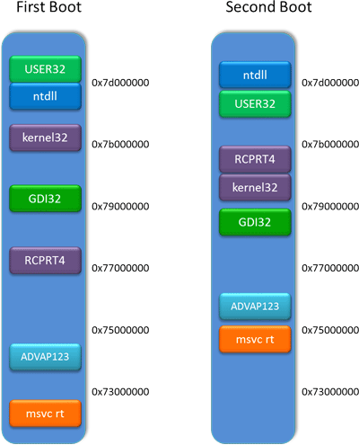

# 概览
## 摘要
### 中文（翻译）
在众多代码重用攻击的防御手段中，信息隐藏(Information Hiding,IH)由于其有效性和高性能，成为是防御手段的一个重要组成模块，如代码指针完整性(CPI)，控制流完整性(CFI)和细粒度的代码重随机化。它使用随机化实现有概率的隐藏系统的关键内存区域，也成为安全区。该区域不能被任何指针直接访问，可以阻止攻击者的攻击行为。这些防御手段使用安全区来保护非常重要的数据，如跳转目标和随机化的密码。然而，最近的研究表明IH在很多攻击手段下不再安全。
在本文中，我们提出一种新的IH技术，称之为SafeHidden。 它能持续重随机化安全区的位置，组织攻击者探索和推理内存布局来寻找安全区的位置。本文提出一种新的线程私有的内存机制，该机制可以让线程本地的安全区孤立化，避免攻击者通过随机熵减少发起攻击。它也可以在TLB（页表）缺失后随机化安全区，来避免攻击者使用基于cache侧信道推理安全区的位置。现有的基于信息隐藏的防御方法无需修改也能使用SafeHidden技术。实验表明SafeHidden不仅可以有效避免已有的攻击手段，并且带来的性能损耗也极小。

### 英文
Information hiding (IH) is an important building block for many defenses against code reuse attacks, such as code-pointer integrity (CPI), control-flow integrity (CFI) and fine-grained code (re-)randomization, because of its effectiveness and performance. It employs randomization to probabilistically ''hide'' sensitive memory areas, called safe areas, from attackers and ensures their addresses are not leaked by any pointers directly. These defenses used safe areas to protect their critical data, such as jump targets and randomization secrets. However, recent works have shown that IH is vulnerable to various attacks.

In this paper, we propose a new IH technique called SafeHidden. It continuously re-randomizes the locations of safe areas and thus prevents the attackers from probing and inferring the memory layout to find its location. A new thread-private memory mechanism is proposed to isolate the thread-local safe areas and prevent adversaries from reducing the randomization entropy. It also randomizes the safe areas after the TLB misses to prevent attackers from inferring the address of safe areas using cache side-channels. Existing IH-based defenses can utilize SafeHidden directly without any change. Our experiments show that SafeHidden not only prevents existing attacks effectively but also incurs low performance overhead.

## 关键词
系统安全；信息隐藏；安全区；地址空间布局随机化(ASLR)
## 出处
USENix Security 2019, 赫赫有名的安全顶级学术会议
## 引用格式
[1]Wang Z, Wu C, Zhang Y, Tang B, Yew P-C, Xie M, Lai Y, Kang Y, Cheng Y, Shi Z. SafeHidden: an efficient and secure information hiding technique using re-randomization. 28th USENIX Security Symposium (USENIX Security 19). Santa Clara, CA: USENIX Association, 2019: 1239–1256.

**URL**: https://www.usenix.org/conference/usenixsecurity19/presentation/wang

## 作者
>Zhe Wang and Chenggang Wu, State Key Laboratory of Computer Architecture, Institute of Computing Technology, Chinese Academy of Sciences, University of Chinese Academy of Sciences; Yinqian Zhang, The Ohio State University; Bowen Tang, State Key Laboratory of Computer Architecture, Institute of Computing Technology, Chinese Academy of Sciences, University of Chinese Academy of Sciences; Pen-Chung Yew, University of Minnesota at Twin-Cities; Mengyao Xie, Yuanming Lai, and Yan Kang, State Key Laboratory of Computer Architecture, Institute of Computing Technology, Chinese Academy of Sciences, University of Chinese Academy of Sciences; Yueqiang Cheng, Baidu USA; Zhiping Shi, The Capital Normal University

一作为Zhe Wang，其导师武成岗为二作，来自中科院计算所国家计算机体系结构重点实验室。

三作张殷乾来自俄亥俄州立大学，曾有幸在[InfoSec][2]听过他对于安全方面论文发表的经验，其实验室和手下的博士生发表了很多的安全顶会论文。

# 笔记
## 论文主题
一种新型的内存地址随机化的增强方案SafeHidden，可以解决内存地址随机化（ASLR）的不安全问题。
## 待解决问题
先来介绍下内存地址随机化技术,这个技术，可以看一下这个[ASLR][1]。一些攻击，比如return-oriented programming (ROP)之类的[代码复用攻击][4]，会试图得到被攻击者的内存布局信息。这样就可以知道代码或者数据放在哪里，来定位并进行攻击。比如可以找到ROP里面的gadget。而ASLR让这些内存区域随机分布，来提高攻击者成功难度，让他们只能通过猜猜猜来进行不断试错的攻击(理想状况下)。下图举了个例子。

## 之前方案不足

## 解决方案
## 效果
# 思考
## 收获
## 不足之处
## 可扩展结合的点
# 论文评价
## 评分
> 满分5
⭐⭐⭐⭐⭐

## 评价

# 参考
[1]:https://www.inforsec.org/wp/?p=1009	"地址空间布局随机化(ASLR)增强研究综述"
[2]:http://www.inforsec.org/ "Infosec 网络安全研究国际学术论坛"

[3]: https://en.wikipedia.org/wiki/Address_space_layout_randomization	"Address space layout randomization（Wikipedia）"

[4]:https://zhuanlan.zhihu.com/p/39695776	"JOP代码复用攻击（知乎）"